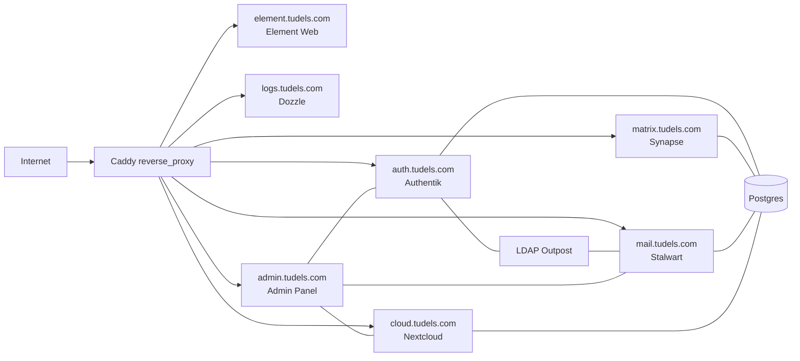

## KMU Server – Self‑Hosted Collaboration Stack

This repository contains an opinionated, **all‑in‑one self‑hosted stack** for a small organization (KMU): identity, chat, mail, storage, and admin tooling, all running on a single Docker host behind Caddy.

### Stack Overview

- **Caddy** (`caddy`) – reverse proxy, TLS, and entrypoint for all HTTPS services.
- **Authentik** (`authentikserver`, `worker`, `authentik-ldap`) – identity provider, SSO, and LDAP directory.
- **PostgreSQL** (`postgres`, `postgres-backup`) – shared database for Authentik, Matrix Synapse, Stalwart, Nextcloud.
- **Matrix Synapse** (`synapse`) – Matrix homeserver.
- **Element Web** (`element`) – Matrix web client, protected by Authentik and auto‑SSO.
- **Nextcloud** (`nextcloud`) – Files, calendar, contacts, collaboration.
- **Stalwart Mail** (`stalwart`) – Mail server (SMTP/IMAP + web UI), backed by Authentik LDAP.
- **Homepage** (`homepage`) – Simple static landing page.
- **Logs / Dozzle** (`dozzle`) – Web UI for live Docker logs, protected by Authentik.
- **Admin panel** (`admin-panel`) – Small FastAPI app to manage users across Authentik, Stalwart, and Nextcloud.
- **User sync worker** (`user-sync`) – Periodic sync logic for Stalwart mailboxes.

Everything is orchestrated via **`docker-compose.yaml`** and bootstrapped end‑to‑end by two scripts:

- [`01-server-installation.sh`](01-server-installation.sh) – one‑time host hardening & Docker/fail2ban setup.
- [`02-system-setup.sh`](02-system-setup.sh) – environment generation, service configuration, Authentik blueprints, and app wiring.

### High‑Level Architecture



### Prerequisites

- Fresh **Ubuntu/Debian** VM with root (or sudo) access.
- Public DNS records for at least:
  - `auth.<domain>`, `cloud.<domain>`, `matrix.<domain>`, `element.<domain>`,
  - `mail.<domain>`, `logs.<domain>`, `admin.<domain>`, and optionally bare `www.<domain>`.
- Ports **80/443** and mail ports (**25/465/993**) reachable from the Internet.

### 1. Host bootstrap (`01-server-installation.sh`)

On a new server, run as root:

```bash
curl -O https://.../01-server-installation.sh   # or copy this repo first
chmod +x 01-server-installation.sh
sudo ./01-server-installation.sh
```

This will:

- Update the system and install:
  - `ca-certificates`, `curl`, `git`, `ufw`, `software-properties-common`, `yq`.
- Install and start **fail2ban** (basic intrusion prevention).
- Install the **Docker Engine** + Docker Compose plugin from Docker’s official repo.
- Configure **UFW**:
  - Allow SSH, HTTP/HTTPS, and mail ports (25/465/993).

> After the script finishes, log out and back in so your user picks up the `docker` group.

### 2. Application bootstrap (`02-system-setup.sh`)

Once this repository is on the server (`/root/kmu-server` is assumed in the scripts), run:

```bash
cd /root/kmu-server
chmod +x 02-system-setup.sh
./02-system-setup.sh
```

You’ll be prompted for:

- `domain` – e.g. `tudels.com`.
- Initial Authentik / system admin user (`username`, full name, password, email).

The script will then:

- Generate random secrets and write **`.env`** (Postgres, Authentik, LDAP, Matrix, Nextcloud, etc.).
- Create Docker networks `caddy-proxy` and `database`.
- Generate **Synapse** config (via the upstream Synapse image) and patch it to use Postgres and Authentik OIDC.
- Templatize and apply **Authentik blueprints**:
  - `admin-user.yaml` – initial Authentik admin user.
  - `synapse.yaml` – Matrix OIDC provider & application.
  - `nextcloud.yaml` – Nextcloud OIDC provider & app.
  - `stalwart.yaml` – LDAP provider & outpost for Stalwart.
  - `dozzle.yaml`, `admin.yaml`, `element-proxy.yaml`, `outpost-proxy.yaml` – proxy providers and embedded outpost wiring for `logs/admin/element`.
- Prepare **Stalwart** configuration (`stalwart/data/etc/config.toml`).
- Prepare **Nextcloud** directories with correct UID (`33`) ownership.
- Bring up the entire Docker stack via `docker compose up -d`.
- Wait for Authentik and Stalwart to become ready and:
  - Discover the LDAP outpost token and patch `.env`.
  - Promote your initial user to Stalwart admin and create base domain + mailbox.
  - Generate `noreply@<domain>` in Authentik / LDAP and wire Nextcloud’s outgoing mail to Stalwart.
- Automatically install & configure Nextcloud via `occ` commands:
  - Trusted domain, HTTPS overwrite, trusted proxies, OIDC provider (`user_oidc` app), default language, and key apps.

> The script is idempotent where practical but still intended for **initial provisioning**. For re‑runs on an existing server, inspect differences carefully.

### 3. Reverse proxy & routing (Caddy)

The Caddy configuration lives in [`caddy/Caddyfile`](caddy/Caddyfile) and:

- Obtains certificates from Let’s Encrypt.
- Routes each subdomain to the right service, e.g.:
  - `auth.<domain>` → `authentik-server:9000`
  - `cloud.<domain>` → `nextcloud:80` (with well‑known redirects).
  - `matrix.<domain>` + well‑known paths on `www.<domain>` → `synapse:8008`.
  - `element.<domain>` → `element:80`.
  - `mail.<domain>` → `stalwart-mail:8080`.
  - `logs.<domain>` → `dozzle:8080`.
  - `admin.<domain>` → `admin-panel:8000`.
- Applies **Authentik forward_auth** to:
  - `logs.<domain>` (`Dozzle Proxy`),
  - `admin.<domain>` (`Admin Panel Proxy`),
  - `element.<domain>` (`Element Proxy`),
  so only authenticated users can access these apps.
- Writes unified **access logs** to `./caddy/logs/access.log` (mounted as `/var/log/caddy/access.log`) for **fail2ban**.

### 4. Identity & SSO (Authentik)

Authentik is the central identity provider:

- Synapse uses Authentik as an OIDC provider, so Matrix accounts are backed by Authentik users.
- Nextcloud uses Authentik via the `user_oidc` app; local login is discouraged.
- Stalwart uses an Authentik LDAP provider + outpost for directory / mailbox provisioning.
- Dozzle, the admin panel, and Element Web sit behind forward_auth providers.

Blueprints are under [`authentik/blueprints`](authentik/blueprints).

### 5. Element Web auto‑SSO

[`element/config.json`](element/config.json) is customized to:

- Point at your Synapse homeserver (`PLACEHOLDER_HOMESERVER` is patched by `02-system-setup.sh`).
- Disable guest access and direct registration/password reset UI.
- Enable **SSO auto‑redirect**:

```json
"sso_redirect_options": {
  "immediate": true,
  "on_welcome_page": true,
  "on_login_page": true
},
"setting_defaults": {
  "UIFeature.registration": false,
  "UIFeature.passwordReset": false
}
```

Combined with Synapse’s OIDC config and Caddy forward_auth, visiting `https://element.<domain>` as an authenticated Authentik user should drop you straight into Element without seeing the generic login screen.

### 6. Mail (Stalwart)

- Container: `stalwart-mail` using the `stalwartlabs/stalwart:latest` image.
- Data lives in `./stalwart/data` (mounted to `/opt/stalwart`).
- SMTP/IMAP ports are exposed directly on the host (25, 465, 993).
- Authentik LDAP outpost keeps Stalwart’s directory in sync with Authentik users.
- `02-system-setup.sh` creates:
  - Your primary mailbox (`<username>@<domain>`),
  - A `noreply@<domain>` account used by Nextcloud.

### 7. Healthchecks

Most services have lightweight Docker healthchecks defined in [`docker-compose.yaml`](docker-compose.yaml), for example:

- `caddy` – `caddy version`.
- `dozzle` – `/dozzle --version`.
- `postgres` – `pg_isready`.
- `stalwart-mail` – `stalwart-cli --version`.
- `nextcloud` – `php -v` (smoke test for PHP runtime).
- `user-sync` – HTTP GET against `authentik-server:9000/-/health/live/`.
- `admin-panel` – HTTP GET against `/api/health`.
- `homepage` – `nginx -t`.

These are primarily to give you quick “green/red” signals via `docker ps` or orchestration dashboards.

### 8. Fail2ban integration

The stack is designed to work with **host‑level fail2ban**:

- `01-server-installation.sh` installs and enables fail2ban.
- Caddy writes access logs to `./caddy/logs/access.log`, which you can point a fail2ban jail at.
- Example filter and jail snippets are in your plan (see `.cursor/plans/add-fail2ban-protection-for-caddy_*.plan.md`) and can be adapted to:
  - Block IPs that generate many 4xx/5xx responses,
  - React aggressively to scans on sensitive endpoints.

### 9. Day‑to‑day operations

From `/root/kmu-server` (or your clone path):

```bash
# Start or update all services
docker compose up -d

# View logs for a specific service
docker compose logs -f authentikserver

# Check health & status
docker ps
```

Admin entrypoints (assuming `DOMAIN=tudels.com`):

- Authentik: `https://auth.tudels.com`
- Nextcloud: `https://cloud.tudels.com`
- Matrix homeserver: `https://matrix.tudels.com`
- Element Web: `https://element.tudels.com`
- Mail web UI (Stalwart): `https://mail.tudels.com`
- Logs (Dozzle): `https://logs.tudels.com`
- Admin panel: `https://admin.tudels.com`

### 10. Contributing / Local development

This repo is primarily infrastructure‑as‑code. For application‑level changes:

- **Admin panel backend** lives under [`admin/backend`](admin/backend); it’s a FastAPI app with its own `requirements.txt` and static React‑less UI (`static/index.html`).
- **Scripts** for Nextcloud & user sync live under [`scripts`](scripts) and [`admin/nextcloud-scripts`](admin/nextcloud-scripts).

Typical development loop for the admin panel (from `admin/backend`):

```bash
python -m venv .venv
source .venv/bin/activate
pip install -r requirements.txt
uvicorn app.main:app --reload
```

Then point your browser at `http://localhost:8000` (note: in production this is only reachable behind Caddy + Authentik).

---

If you’d like, we can extend this README further with environment variable reference tables or a more detailed “troubleshooting” section as the stack evolves.

