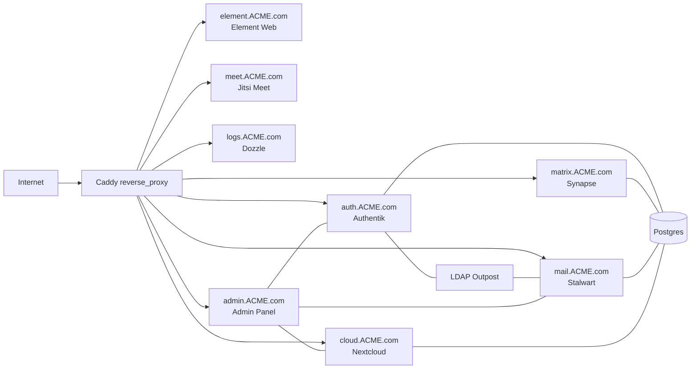

## KMU Server – Self‑Hosted Collaboration Stack

This repository contains an opinionated, **all‑in‑one self‑hosted stack** for a small organization (KMU): identity, chat, mail, storage, and admin tooling, all running on a single Docker host behind Caddy.

### Stack Overview

- **Caddy** (`caddy`) – reverse proxy, TLS, and entrypoint for all HTTPS services.
- **Authentik** (`authentikserver`, `worker`, `authentik-ldap`) – identity provider, SSO, and LDAP directory.
- **PostgreSQL** (`postgres`, `postgres-backup`) – shared database for Authentik, Matrix Synapse, Stalwart, Nextcloud, Immich.
- **Matrix Synapse** (`synapse`) – Matrix homeserver.
- **Element Web** (`element`) – Matrix web client, protected by Authentik and auto‑SSO.
- **Nextcloud** (`nextcloud`) – Files, calendar, contacts, collaboration.
- **Vaultwarden** (`vaultwarden`) – Bitwarden-compatible password manager; SSO via Authentik.
- **Immich** (`immich-server`, `redis`) – Photo/video backup; OAuth via Authentik.
- **Jitsi Meet** (`web`, `prosody`, `jicofo`, `jvb`) – Self‑hosted video conferencing at `meet.<domain>`; internal auth for room creators, anonymous guests allowed.
- **coturn** (`coturn`) – TURN server for Jitsi (NAT traversal); reachable at `turn.<domain>`.
- **Stalwart Mail** (`stalwart`) – Mail server (SMTP/IMAP + web UI), backed by Authentik LDAP.
- **Homepage** (`homepage`) – Simple static landing page.
- **Logs / Dozzle** (`dozzle`) – Web UI for live Docker logs, protected by Authentik.
- **Admin panel** (`admin-panel`) – Small FastAPI app to manage users across Authentik, Stalwart, and Nextcloud.
- **User sync worker** (`user-sync`) – Periodic sync logic for Stalwart mailboxes.

**Documentation:** All operational details (DNS, env vars, daily ops, updating) are in the [docs/](docs/) folder so you can keep this repo as the single source of truth without storing runtime data in git.

### Where things live (on the server)

| Purpose | Location | In git? |
|--------|----------|--------|
| Secrets & config | `.env` (root) | No – generated by setup, backed up by `backup.sh`. |
| Env template | [.env.example](.env.example) | Yes – reference only. |
| Caddy TLS & config | `caddy/data`, `caddy/config`, `caddy/Caddyfile` | Caddyfile yes; data no. |
| Authentik DB, blueprints | `authentik/data`, `authentik/blueprints`, `authentik/custom-templates` | Blueprints yes (templated); data no. |
| Postgres data | Docker volume `database` + dump in `backups/postgres` | No. |
| Nextcloud files & DB | `nextcloud/data`, `nextcloud/config` | No. |
| Vaultwarden vault | `vaultwarden/data` | No. |
| Immich library & OAuth config | `immich/library`, `immich/immich.json` | immich.json templated by setup; library no. |
| Snapshots | `backups/snapshots/<timestamp>/` | No – keep off-server for disaster recovery. |

Everything is orchestrated via **`docker-compose.yaml`** and bootstrapped end‑to‑end by two scripts:

- [`01-server-installation.sh`](01-server-installation.sh) – one‑time host hardening & Docker/fail2ban setup.
- [`02-system-setup.sh`](02-system-setup.sh) – environment generation, service configuration, Authentik blueprints, and app wiring.

### High‑Level Architecture



### Prerequisites

- Fresh **Ubuntu/Debian** VM with root (or sudo) access.
- Public DNS records for all service hostnames (see [docs/DNS-AND-PORTS.md](docs/DNS-AND-PORTS.md)): at least `auth.<domain>`, `cloud.<domain>`, `matrix.<domain>`, `element.<domain>`, `mail.<domain>`, `logs.<domain>`, `admin.<domain>`, `meet.<domain>`, `turn.<domain>`, `vaultwarden.<domain>`, `immich.<domain>`, and optionally bare `www.<domain>`.
- Ports **80/443** and mail ports (**25/465/993**) reachable from the Internet; **UDP 10000** (Jitsi JVB) and **3478/5349** TCP+UDP (TURN) for video conferencing.

### 1. Host bootstrap (`01-server-installation.sh`)

On a new server, run as root:

```bash
git clone https://github.com/chrishenschel/kmu-server.git
chmod +x 01-server-installation.sh
sudo ./01-server-installation.sh
```

This will:

- Update the system and install:
  - `ca-certificates`, `curl`, `git`, `ufw`, `software-properties-common`, `yq`.
- Install and start **fail2ban** (basic intrusion prevention).
- Install the **Docker Engine** + Docker Compose plugin from Docker’s official repo.
- Configure **UFW**:
  - Allow SSH, HTTP/HTTPS, mail ports (25/465/993), Jitsi JVB (UDP 10000), and TURN (3478/5349 TCP+UDP).

> After the script finishes, log out and back in so your user picks up the `docker` group.

### 2. Application bootstrap (`02-system-setup.sh`)

Once this repository is on the server (`./kmu-server` is assumed in the scripts), run:

```bash
cd kmu-server
chmod +x 02-system-setup.sh
./02-system-setup.sh
```

You’ll be prompted for:

- `domain` – e.g. `ACME.com`.
- Initial Authentik / system admin user (`username`, full name, password, email).

The script will then:

- Generate random secrets and write **`.env`** (Postgres, Authentik, LDAP, Matrix, Nextcloud, etc.).
- Create Docker networks `caddy-proxy` and `database`.
- Generate **Synapse** config (via the upstream Synapse image) and patch it to use Postgres and Authentik OIDC.
- Templatize and apply **Authentik blueprints**:
  - `admin-user.yaml` – initial Authentik admin user.
  - `synapse.yaml` – Matrix OIDC provider & application.
  - `nextcloud.yaml` – Nextcloud OIDC provider & app.
  - `vaultwarden.yaml` – Vaultwarden SSO (custom email scope + OIDC).
  - `immich.yaml` – Immich OAuth (web + mobile redirect URIs).
  - `stalwart.yaml` – LDAP provider & outpost for Stalwart.
  - `dozzle.yaml`, `admin.yaml`, `element-proxy.yaml`, `outpost-proxy.yaml` – proxy providers and embedded outpost wiring for `logs/admin/element`.
- Prepare **Stalwart** configuration (`stalwart/data/etc/config.toml`).
- Prepare **Nextcloud** directories with correct UID (`33`) ownership.
- Prepare **Jitsi Meet** (`jitsi/.env.meet`) and **coturn** (`coturn/turnserver.conf`): patch domain and generate secrets (XMPP, TURN).
- Bring up the entire Docker stack via `docker compose up -d --remove-orphans`.
- Wait for Authentik and Stalwart to become ready and:
  - Discover the LDAP outpost token and patch `.env`.
  - Promote your initial user to Stalwart admin and create base domain + mailbox.
  - Generate `noreply@<domain>` in Authentik / LDAP and wire Nextcloud’s outgoing mail to Stalwart.
- Automatically install & configure Nextcloud via `occ` commands:
  - Trusted domain, HTTPS overwrite, trusted proxies, OIDC provider (`user_oidc` app), default language, and key apps.

> The script is idempotent where practical but still intended for **initial provisioning**. For re‑runs on an existing server, inspect differences carefully.

### 3. Reverse proxy & routing (Caddy)

The Caddy configuration lives in [`caddy/Caddyfile`](caddy/Caddyfile) and:

- Obtains certificates from Let’s Encrypt.
- Routes each subdomain to the right service, e.g.:
  - `auth.<domain>` → `authentik-server:9000`
  - `cloud.<domain>` → `nextcloud:80` (with well‑known redirects).
  - `matrix.<domain>` + well‑known paths on `www.<domain>` → `synapse:8008`.
  - `element.<domain>` → `element:80`.
  - `mail.<domain>` → `stalwart-mail:8080`.
  - `meet.<domain>` → `web:80` (Jitsi Meet; no forward_auth so guests can join).
  - `logs.<domain>` → `dozzle:8080`.
  - `admin.<domain>` → `admin-panel:8000`.
  - `vaultwarden.<domain>` → `vaultwarden:80` (SSO login on the app).
  - `immich.<domain>` → `immich-server:2283` (OAuth login on the app).
- Applies **Authentik forward_auth** to:
  - `logs.<domain>` (`Dozzle Proxy`),
  - `admin.<domain>` (`Admin Panel Proxy`),
  - `element.<domain>` (`Element Proxy`),
  so only authenticated users can access these apps.
- Writes unified **access logs** to `./caddy/logs/access.log` (mounted as `/var/log/caddy/access.log`) for **fail2ban**.

### 4. Identity & SSO (Authentik)

Authentik is the central identity provider:

- Synapse uses Authentik as an OIDC provider, so Matrix accounts are backed by Authentik users.
- Nextcloud uses Authentik via the `user_oidc` app; local login is discouraged.
- Stalwart uses an Authentik LDAP provider + outpost for directory / mailbox provisioning.
- Dozzle, the admin panel, and Element Web sit behind forward_auth providers.

Blueprints are under [`authentik/blueprints`](authentik/blueprints).

### 5. Element Web auto‑SSO & Jitsi meetings

[`element/config.json`](element/config.json) is customized to:

- Point at your Synapse homeserver (`PLACEHOLDER_HOMESERVER` is patched by `02-system-setup.sh`).
- Disable guest access and direct registration/password reset UI.
- Enable **SSO auto‑redirect**:

```json
"sso_redirect_options": {
  "immediate": true,
  "on_welcome_page": true,
  "on_login_page": true
},
"setting_defaults": {
  "UIFeature.registration": false,
  "UIFeature.passwordReset": false
}
```

Combined with Synapse’s OIDC config and Caddy forward_auth, visiting `https://element.<domain>` as an authenticated Authentik user should drop you straight into Element without seeing the generic login screen.

Element is also configured to use the self‑hosted **Jitsi Meet** instance at `https://meet.<domain>` for ad‑hoc video meetings:

- `meet.<domain>` is served by Jitsi’s `web` container via Caddy, without additional Authentik forward_auth, so **anonymous guests can join** an existing room once an authenticated host is present.
- Room creation is protected by Jitsi’s **internal authentication** (secure‑domain mode), so only users with Jitsi credentials can start new meetings.
- From Element, when you start a Jitsi call, the integration uses `https://meet.<domain>` as the conference host.

You can also paste `https://meet.<domain>/<room>` URLs into **Nextcloud** resources (calendar invitations, Deck cards, Collectives pages, etc.) so that meeting participants can join with a single click.

### 6. Jitsi Meet & TURN

- **Containers**: `web` (Jitsi Meet frontend), `prosody` (XMPP), `jicofo` (conference focus), `jvb` (video bridge), plus **coturn** for TURN/STUN. All defined in [`docker-compose.yaml`](docker-compose.yaml); Jitsi config in [`jitsi/.env.meet`](jitsi/.env.meet), coturn in [`coturn/turnserver.conf`](coturn/turnserver.conf).
- **DNS**: Point `meet.<domain>` and `turn.<domain>` at your server; Caddy serves Meet over HTTPS; TURN is reached directly on ports 3478 (UDP/TCP) and 5349 (TLS).
- **Firewall**: `01-server-installation.sh` opens UDP 10000 (JVB media) and 3478/5349 TCP+UDP (TURN). Ensure these are open if you host behind an external firewall.
- **Auth**: Meet uses **JWT authentication** (see [`jitsi/.env.meet`](jitsi/.env.meet)). The **meet-sso** container issues JWTs when users hit `meet.<domain>` after Authentik login; only users with a valid JWT can start meetings. Guests can join existing rooms. The Authentik blueprint [`authentik/blueprints/meet.yaml`](authentik/blueprints/meet.yaml) registers the Meet app with the proxy outpost. The Nextcloud Jitsi app is enabled and configured to use `https://meet.<domain>/` via `02-system-setup.sh`.

### 7. Mail (Stalwart)

- Container: `stalwart-mail` using the `stalwartlabs/stalwart:latest` image.
- Data lives in `./stalwart/data` (mounted to `/opt/stalwart`).
- SMTP/IMAP ports are exposed directly on the host (25, 465, 993).
- Authentik LDAP outpost keeps Stalwart’s directory in sync with Authentik users.
- `02-system-setup.sh` creates:
  - Your primary mailbox (`<username>@<domain>`),
  - A `noreply@<domain>` account used by Nextcloud.

### 8. Healthchecks

Most services have lightweight Docker healthchecks defined in [`docker-compose.yaml`](docker-compose.yaml), for example:

- `caddy` – `caddy version`.
- `dozzle` – `/dozzle --version`.
- `postgres` – `pg_isready`.
- `stalwart-mail` – `stalwart-cli --version`.
- `nextcloud` – `php -v` (smoke test for PHP runtime).
- `user-sync` – HTTP GET against `authentik-server:9000/-/health/live/`.
- `admin-panel` – HTTP GET against `/api/health`.
- `homepage` – `nginx -t`.

These are primarily to give you quick “green/red” signals via `docker ps` or orchestration dashboards.

### 9. Fail2ban integration

The stack is designed to work with **host‑level fail2ban**:

- `01-server-installation.sh` installs and enables fail2ban.
- Caddy writes access logs to `./caddy/logs/access.log`, which you can point a fail2ban jail at.
- Example filter and jail snippets are in your plan (see `.cursor/plans/add-fail2ban-protection-for-caddy_*.plan.md`) and can be adapted to:
  - Block IPs that generate many 4xx/5xx responses,
  - React aggressively to scans on sensitive endpoints.

### 10. Day‑to‑day operations

From `/root/kmu-server` (or your clone path):

```bash
# Start or update all services
docker compose up -d

# View logs for a specific service
docker compose logs -f authentikserver

# Check health & status
docker ps
```

**Documentation:** See [docs/](docs/) for detailed reference:

- [docs/DNS-AND-PORTS.md](docs/DNS-AND-PORTS.md) – DNS records and firewall ports.
- [docs/ENV-REFERENCE.md](docs/ENV-REFERENCE.md) – All environment variables.
- [docs/OPERATIONS.md](docs/OPERATIONS.md) – Daily ops: start/stop, logs, adding users, admin URLs.
- [docs/UPDATING.md](docs/UPDATING.md) – How to pull repo updates without losing data.

Admin entrypoints (assuming `DOMAIN=ACME.com`):

- Authentik: `https://auth.ACME.com`
- Nextcloud: `https://cloud.ACME.com`
- Matrix homeserver: `https://matrix.ACME.com`
- Element Web: `https://element.ACME.com`
- Jitsi Meet: `https://meet.ACME.com`
- Mail web UI (Stalwart): `https://mail.ACME.com`
- Logs (Dozzle): `https://logs.ACME.com`
- Admin panel: `https://admin.ACME.com`
- Vaultwarden: `https://vaultwarden.ACME.com` (use “Single sign-on”)
- Immich: `https://immich.ACME.com` (use “Login with OAuth”)

**First login:** Use the username and password you gave to `02-system-setup.sh`. Log in to Authentik first; then use “Log in with OAuth” or “Single sign-on” for Nextcloud, Vaultwarden, and Immich. Element and Meet use the same Authentik session when behind forward_auth. For Immich, the setup script creates a bootstrap admin so the first visit shows the login page (and OAuth) instead of the Admin Registration form; log in with any Authentik user.

### 11. Contributing / Local development

This repo is primarily infrastructure‑as‑code. For application‑level changes:

- **Admin panel backend** lives under [`admin/backend`](admin/backend); it’s a FastAPI app with its own `requirements.txt` and static React‑less UI (`static/index.html`).
- **Scripts** for Nextcloud & user sync live under [`scripts`](scripts) and [`admin/nextcloud-scripts`](admin/nextcloud-scripts).

Typical development loop for the admin panel (from `admin/backend`):

```bash
python -m venv .venv
source .venv/bin/activate
pip install -r requirements.txt
uvicorn app.main:app --reload
```

Then point your browser at `http://localhost:8000` (note: in production this is only reachable behind Caddy + Authentik).

### 12. Backup & restore

For basic disaster recovery, you can take logical backups of Postgres plus the key data directories for Authentik, Synapse, Nextcloud, Stalwart, Vaultwarden, Immich, Caddy, Jitsi, and the existing Postgres backup volume. **Always keep at least one snapshot off the server** (another disk or machine); the repo does not store your data.

- **Create a snapshot** (from the repo root):

```bash
chmod +x backup.sh restore.sh
./backup.sh
```

By default the script **stops the stack** before archiving so no files are written during backup, then brings the stack back up. It will:

- Stop all services (`docker compose down`).
- Start Postgres only and write a full cluster dump (`pg_dumpall -c`) and copy `.env` (if present) into the snapshot.
- Stop Postgres, then archive the data directories (authentik/data, authentik/blueprints, authentik/custom-templates, synapse/data, nextcloud/*, stalwart/data, vaultwarden/data, immich/library, immich/immich.json, caddy/*, jitsi/config, backups/postgres) into `backups/snapshots/<timestamp>/`.
- Start the full stack again (`docker compose up -d`).

Use `./backup.sh --online` to take a snapshot **without** stopping the stack (no downtime, but some files may be in use during the backup). Use `./backup.sh --help` for options.

- **Restore from a snapshot**:

```bash
./restore.sh backups/snapshots/<timestamp>
```

The restore script will:

- Run `docker compose down`.
- Restore the archived data directories from the snapshot.
- Optionally restore `.env` from the snapshot.
- Start Postgres, wait for it to be healthy, and apply `postgres.sql`.
- Bring the full stack back up via `docker compose up -d`.

**Updating the installation:** To pull repo changes later (e.g. script fixes, new services) without losing data, see [docs/UPDATING.md](docs/UPDATING.md). In short: backup, `git pull`, merge any new env vars into `.env`, then `docker compose pull && docker compose up -d`.

### 13. Environment variable reference

Generated or used by `02-system-setup.sh` and Compose. **Do not commit `.env`**; it contains secrets. A commented template with every variable is in [.env.example](.env.example). Full descriptions: [docs/ENV-REFERENCE.md](docs/ENV-REFERENCE.md).

| Variable | Set in | Purpose |
|----------|--------|---------|
| `DOMAIN` | `.env` | Base domain (e.g. `example.com`); used in Caddyfile, blueprints, Nextcloud, Jitsi, Vaultwarden, Immich. |
| `USERNAME`, `PASSWORD`, `USERFULLNAME` | `.env` | Initial admin user (Authentik, Nextcloud admin, Stalwart). |
| `PG_PASS` | `.env` | PostgreSQL password (all DBs). |
| `AUTHENTIK_SECRET_KEY`, `AUTHENTIK_BOOTSTRAP_*` | `.env` | Authentik bootstrap and secret key. |
| `LDAP_BASE_DN`, `LDAP_OUTPOST_TOKEN` | `.env` | LDAP for Stalwart; outpost token discovered after blueprints apply. |
| `MATRIX_CLIENT_ID`, `MATRIX_CLIENT_SECRET` | `.env` | Synapse OIDC provider (Authentik). |
| `NC_CLIENT_ID`, `NC_CLIENT_SECRET` | `.env` | Nextcloud OIDC provider (Authentik). |
| `VW_CLIENT_ID`, `VW_CLIENT_SECRET` | `.env` | Vaultwarden SSO (Authentik). |
| `IMMICH_CLIENT_ID`, `IMMICH_CLIENT_SECRET` | `.env` | Immich OAuth (Authentik + immich/immich.json). |
| `NOREPLY_EMAIL`, `NOREPLY_MAIL_PASSWORD` | `.env` | Nextcloud outgoing mail (Stalwart). |
| `JWT_APP_ID`, `JWT_APP_SECRET`, `MEET_DOMAIN` | `.env` | Jitsi Meet SSO. |

**Jitsi** ([`jitsi/.env.meet`](jitsi/.env.meet)) – patched by `02-system-setup.sh`; placeholders replaced on first run:

| Variable | Purpose |
|----------|---------|
| `CONFIG` | Host path for Jitsi config/volumes (default `./jitsi/config` in compose). |
| `PUBLIC_URL` | Public Jitsi URL, e.g. `https://meet.<domain>`. |
| `XMPP_SERVER` | Prosody hostname; must be `prosody` (Docker service name). |
| `ENABLE_AUTH`, `ENABLE_GUESTS`, `AUTH_TYPE` | Secure-domain auth (internal); guests allowed. |
| `JICOFO_AUTH_PASSWORD`, `JVB_AUTH_PASSWORD` | XMPP component passwords (random, patched). |
| `TURN_HOST`, `TURNS_HOST`, `TURN_*` | TURN server (coturn); host = `turn.<domain>`, credentials patched. |

**coturn** uses [`coturn/turnserver.conf`](coturn/turnserver.conf); `realm` and `user`/password are patched from the same domain and TURN credentials as Jitsi.

### 14. Troubleshooting

| Symptom | Likely cause | What to do |
|--------|----------------|------------|
| Caddy fails to start: `module not registered: caddy.logging.encoders.single_field` | Caddy image doesn't include that encoder. | Use a plain `log { output file ... }` block (no `format`), or a supported encoder. |
| `The "CONFIG" variable is not set` when running `docker compose` | Compose substitutes `CONFIG` at parse time; it's only in `jitsi/.env.meet`. | Compose file uses `${CONFIG:-./jitsi/config}`; ensure you have that default. Re-pull or fix locally. |
| Orphan container warning (e.g. `kmu-server-web-1`) | Left over from an old compose overlay or renamed service. | Run `docker compose up -d --remove-orphans` once; the setup script uses this by default. |
| Jicofo/JVB: `UnknownHostException: xmpp.meet.jitsi` | XMPP_SERVER was unset or wrong; they can't resolve Prosody. | Set `XMPP_SERVER=prosody` in `jitsi/.env.meet` and restart Jitsi services (`web`, `prosody`, `jicofo`, `jvb`). |
| Jitsi: no video/audio or "connection failed" | Firewall/NAT: JVB (UDP 10000) or TURN (3478/5349) not reachable; or DNS for `meet.<domain>` / `turn.<domain>` missing. | Open UDP 10000 and 3478/5349 TCP+UDP on host and any external firewall; add A records for `meet.<domain>` and `turn.<domain>`. |
| Nextcloud: "Login failed" or OIDC errors | Wrong client id/secret, or trusted domain / overwrite URL mismatch. | Check `.env` has correct `NC_CLIENT_ID` / `NC_CLIENT_SECRET`; in Nextcloud, `occ config:system:get overwrite.cli.url` should be `https://cloud.<domain>`. Re-run provider setup from Settings if needed. |
| Element: redirect loop or "Cannot reach homeserver" | Synapse not ready, or Caddy/well-known not serving Matrix discovery. | Ensure `matrix.<domain>` and `www.<domain>` (well-known) point to Caddy; check `synapse` logs and `https://matrix.<domain>/_matrix/client/versions`. |
| Stalwart: LDAP login fails or no mailboxes | LDAP outpost token not set or outpost not running. | Re-run setup until the script prints "Got outpost token"; ensure `LDAP_OUTPOST_TOKEN` in `.env` and `authentik-ldap` container is up. |
| Stalwart: `No TLS certificates available (tls.no-certificates-available)` | Stalwart reads TLS certs from Caddy's data dir; path must match your Caddy layout. | Ensure `stalwart/data/etc/config.toml` has the real domain (no `__DOMAIN__`). Check where Caddy stores certs: `ls caddy/data/caddy/certificates/.../mail.<domain>/` or `ls caddy/data/certificates/.../mail.<domain>/`. Use that path in config: either `.../caddy-data/caddy/certificates/...` or `.../caddy-data/certificates/...`. Then `docker compose restart stalwart-mail`. |
| Vaultwarden: "Use single sign-on" fails or email not verified | Authentik must expose `email_verified: true` for the email scope. | Ensure the Vaultwarden blueprint is applied (custom "Vaultwarden Email Scope" mapping). See [Authentik Vaultwarden integration](https://integrations.goauthentik.io/security/vaultwarden/). |
| Immich: OAuth not offered or redirect error | Immich OAuth is configured via `immich/immich.json` (issuer URL, client id/secret). | Ensure setup has run so `immich/immich.json` has no `__DOMAIN__`/`__IMMICH_CLIENT_*__` placeholders; or set OAuth in Immich Admin → Settings → OAuth. |
| Immich: shows "Admin Registration" instead of login / OAuth | Immich shows the first-time admin signup when there are no users. | Create the first user once via API so the login page (and OAuth) is shown. From the server: `curl -sk -X POST "https://immich.<your-domain>/api/auth/admin-sign-up" -H "Content-Type: application/json" -d '{"email":"immich-bootstrap@<your-domain>","name":"Immich Bootstrap","password":"CHANGE_ME_STRONG_PASSWORD"}'`. Use a strong password (you can ignore it afterwards; log in via Authentik). Then reload Immich; the next visit shows the login page and OAuth. |

Useful commands:

```bash
docker compose ps
docker compose logs -f caddy
docker compose logs -f jitsi-jicofo
docker exec --user www-data nextcloud php occ status
```


